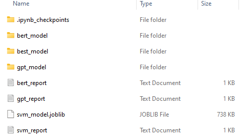

# Info on models training

All the models were trained and saved in this folder.
However, when trained, the files for trained BERT-base and GPT-2 are too big and require more space than available on GitHub.
Due to this, this folder contains only a txt with the evaluation metrics for each of the models.

## What this folder should contain:

- *bert_model* folder, containing all the files of the trained model
- *gpt_model* folder, containing all the files of the trained model
- *best_model* folder, containing the best trained model
- *svm_model.joblib*, the trained SVM model
